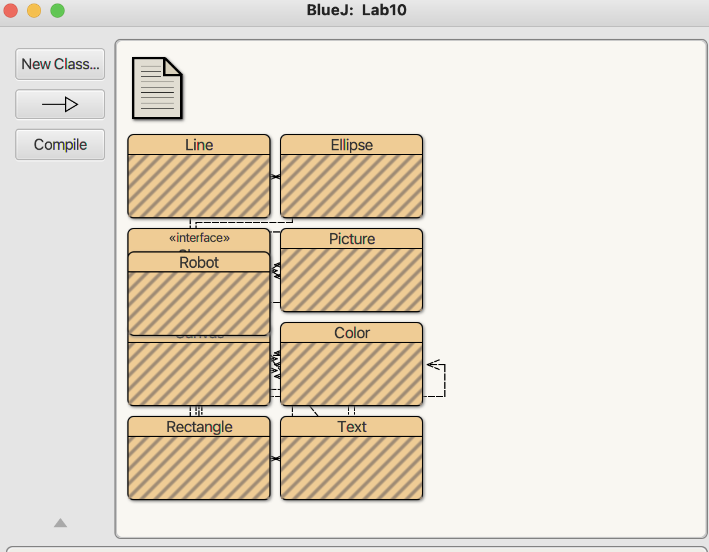
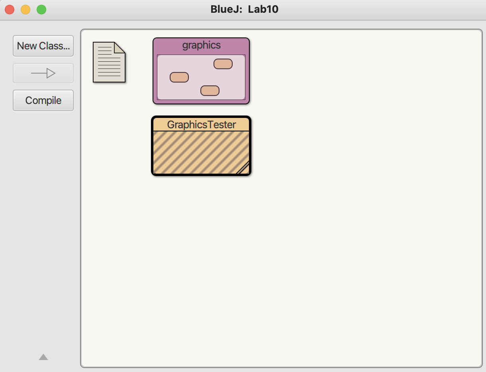

# **CS 46A Lab 10: Packages, Interfaces, and Unit Testing**

In this lab, you will organize Java classes into packages, design a class hierarchy using inheritance and interfaces, and write unit tests using BlueJ.

---

## **During this lab, you will learn how to do the following:**

* Organize Java classes using **packages**
* Use **inheritance** to create a superclass
* Implement an **interface** across multiple classes
* Write and run **JUnit tests in BlueJ**

---

## **An Important Reminder**

Please make sure to read every single word of these instructions. Many issues you run into during labs can be solved by simply looking more closely. 

We try to keep instructions short, so everything here is important.

---

# **Timing Guide (Recommended)**

* Packages: 20 min
* Superclass: 15–20 min
* Interface + subclasses: 30–40 min
* JUnit testing: 20–30 min

---

# Part 0: Project Setup

You will begin by creating a new BlueJ project and importing the graphics files.

## Step 1: Create a new BlueJ project

Open BlueJ and create a new project named:

```text
lab12
```

inside your `cs46a/labs` folder.

## Step 2: Locate your unzipped graphics folder

The folder should be located somewhere within your cs46a/labs

The folder should contain:

* some Java files
* at least 3 image files

## Step 3: Import the graphics files

Import the graphics folder into your BlueJ project.

### In BlueJ:

1. Select **Project**
2. Select **Import**
3. Navigate to the graphics folder in your `cs46a/labs` directory
4. Select the folder and confirm

## Step 4: Compile the imported classes

Click **Tools** --> **Compile** to compile all imported graphics classes.

## Step 5: Verify your project

Your BlueJ window should now show the imported graphics classes like this:



---

# Part 1: Organizing Classes into a Package

In this part, you will move the imported graphics classes into their own package so they can be imported neatly into another file.

### Step 0: Create Package within Project

Inside Blue-J, Create a package named:

```java
graphics
```

### Step 1: Add a package declaration

At the top of each imported graphics `.java` file, add:

```java
package graphics;
```

This line must be the **first line** in the file.

This will prompt you to move the file to the associate graphics package, select `Yes`. If you are not prompted to move the files, you may have to move the files manually via your Systems File Manager.

### Step 2: Recompile the files

Compile all graphics classes again.

### Step 3: Create a tester class outside the package

Create a new class named:

```java
GraphicsTester
```

This class should **not** be inside the `graphics` package.

Note: your project setup should look like this: 


### Step 4: Import the package into the tester

At the top of `GraphicsTester.java`, write:

```java
import graphics.*;
```

### Step 5: Use at least one imported class

Inside `main`, create at least one object from the imported package and draw it. 

## Checkpoint 1

You should have:

* the `package graphics;` line in your imported files
* the `import graphics.*;` line in `GraphicsTester`
* a successful compile and drawn image

### Scribe Questions:

1. What problem do packages solve in large Java programs?
2. What is the difference between package and import?
3. What happens if two classes in different packages have the same name?
4. Why is it important that package graphics; is the first line in a file?

---

# **Part 2: Superclass Set up**

Now you will design a **base class** that other classes will inherit from.

---

## **Step 1: Create the Vehicle Class**

Create a class:

```java
Vehicle
```

### Required:

* Instance variables:

  * `String brand`
  * `int maxSpeed`
  * `double mileage`

* Constructor:

```java
public Vehicle(String brand, int maxSpeed)
```

* Implement the following Methods:

```java
public String getBrand()
public int getMaxSpeed()
public double getCurrentMileage()
public String toString()
```

---

## **Step 2: Test Quickly**

Create a simple object in a temporary `main()`:

```java
Vehicle v = new Vehicle("Test", 100);
System.out.println(v);
```

---

### **Scribe Questions**

5. What do you think the mileage instance variable will be used for?
6. What did your print statement output and why?

---

# **Part 3: Interface + Subclasses**

Now you will design behavior shared across all vehicles.

---

## **Step 1: Create the Interface**

Create a new Interface called:

```java
Drivable
```

Interfaces can be chosen via "Class Type" when creating a New Class in Blue-J.

Copy the following code:

```java
public interface Drivable
{
    void drive(double miles);
    double getFuelEfficiency();
    double getCurrentMileage();
}
```

---

## **Step 2: Create Subclasses**

Create normal Java Classes:

* `Motorcycle`
* `Sedan`
* `SemiTruck`

Each must:

* `extend Vehicle`
* `implement Drivable`

---

## **Step 3: Add Fields**

Each subclass should include its own instance variable:

```java
double fuelEfficiency;
```

---

## **Step 4: Implement Methods**

Each class must implement:

* `drive(double miles)`
* `getFuelEfficiency()`
* `getCurrentMileage()`

---

## STOP

Regarding `drive` when our car drives, what calculations should we make, and what variables should be updated to reflect these changes?

## **Step 5: Add Vehicle Type**

Add this method:

```java
public String getVehicleType()
```

Return:

* `"Motorcycle"`
* `"Sedan"`
* `"SemiTruck"`

---

## **Step 6: Manual Testing**

Create a Class called:

```java
VehicleTester
```

In the main method test the following:

* create one of each vehicle
* call `drive()`
* print results before and after

---

### **Scribe Questions**

7. What is the difference between `extends` and `implements`?
8. Why do interfaces not include method bodies or instance variables?
9. How does implementing an interface enforce structure across classes?
10. How can different subclasses be treated the same using a `Vehicle` reference?

---

# **Part 4: JUnit Testing in BlueJ**

Now you will test your code using BlueJ’s built-in JUnit tools.

---

## **What are Unit Tests?**

Unit tests are an automated way to verify that **individual parts of your program (methods)** work correctly.

Instead of manually printing values and checking them yourself, you:

* define an **expected result**
* compare it to the **actual result**
* let the program tell you if it is correct

This makes testing:

* faster
* repeatable
* more reliable as programs grow larger

---

## **Step 1: Enable Testing Tools**

In BlueJ:

* Go to **Tools → Preferences**
* Enable **Show Testing Tools**

This will allow you to:

* create test classes
* record test methods
* run all tests at once

---

## **Step 2: Create Test Classes**

Right-click a class (for example, `Motorcycle`) and select:

```text
Create Test Class
```

This creates a new class like:

```text
MotorcycleTest
```

This class will contain your unit tests.

---

## **Step 3: Create Test Methods**

Right-click the test class and select:

```text
Create Test Method
```

BlueJ will now **record your actions**.

Anything you do (creating objects, calling methods) will be turned into a test.

---

## **Step 4: Required Tests (with Explanation)**

Each vehicle class must have at least **2 test methods**.

Below are examples of what you should test, along with explanations of what each test is verifying.

---

### **Test 1: Constructor Test**

**Goal:** Verify that the object is created correctly.

What you do:

* Create a new object
* Call getter methods
* Compare the returned values to what you expect

**Example idea:**

* Create: `Motorcycle("Yamaha", 120, 55.0)`
* Check:

  * `getBrand()` → `"Yamaha"`
  * `getMaxSpeed()` → `120`

**What this test is doing:**
This test ensures that:

* the constructor correctly assigns values to instance variables
* your object starts in a valid state

If this test fails, it usually means:

* the constructor didn’t initialize something correctly
* or a getter method is wrong

---

### **Test 2: Fuel Efficiency Test**

**Goal:** Verify that fuel efficiency is returned correctly.

What you do:

* Call `getFuelEfficiency()`
* compare it to the expected value

**What this test is doing:**
This test checks:

* that your subclass correctly stores and returns its unique data
* that your implementation of the interface method works

---

### **Important Note (Doubles)**

Since fuel efficiency is a `double`, small rounding errors can happen.

BlueJ will ask for a **tolerance value**.

Example:

```text
Expected: 55.0
Tolerance: 0.01
```

This means values close enough are considered correct.

---

### **Test 3: Drive Method Test**

**Goal:** Verify that calling `drive()` updates mileage correctly.

What you do:

* Create a new object (mileage starts at 0)
* Call `drive(20.5)`
* check `getCurrentMileage()`

Expected:

```text
20.5
```

**What this test is doing:**
This test verifies:

* that your method correctly modifies the object’s internal state
* that mileage increases properly when driving

If this fails:

* you may not be updating mileage correctly
* or you may not be using the superclass variable properly

---

### **Test 4: Vehicle Type Test**

**Goal:** Verify correct behavior of overridden methods.

What you do:

* Call `getVehicleType()`
* compare the returned string

Expected:

```text
"Motorcycle"
```

**What this test is doing:**
This test checks:

* that your subclass is correctly overriding methods
* that polymorphism is working properly

---

## **Step 5: Run Tests**

Click:

```text
Run Tests
```

### Results:

* ✅ Green → test passed
* ❌ Red → test failed

If a test fails:

* check expected vs actual values
* review your method logic

---

## **Minimum Requirements**

You must create at least:

```text
2 tests per class × 3 classes = 6 tests total
```

Recommended:

* constructor test
* drive test
* fuel efficiency test
* vehicle type test

---

## **How to Think About Testing (Important)**

Each test should answer:

> “If I run this method, do I get the correct result?”

Good tests:

* are simple
* test one thing at a time
* use clear expected values

---

## **Scribe Questions**

11. What is the purpose of a unit test, and how is it different from manual testing?
12. What does it mean if a test passes? What does it mean if it fails?
13. Why should unit tests focus on small, individual methods instead of the whole program?
14. Why do we use a tolerance value when testing `double` values?

## Submission
Submit the following:
* Scribe Document
* All associated .java files